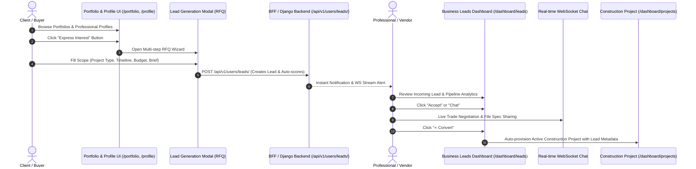

# Architecture Playbook — End-to-End Portfolio, Profile, Express Interest & Business Leads Flow

> **System Architecture & Data Flow Guide**  
> Technical documentation covering the commercial acquisition pipeline from **Public Portfolio Showcase** and **Professional Profile** to **Express Interest RFQ**, **Business Lead Pipeline**, **Real-Time Trade Negotiation Chat**, and **Active Construction Project Conversion**.

---

## 1. Executive System Overview

Architecture Playbook provides a frictionless commercial funnel for architectural firms, general contractors, sub-contractors, and building product vendors:



---

## 2. Component Analysis & Data Flows

### Component A: Public Portfolio Showcase (`/portfolio/[id]`)
- **Primary Responsibility**: High-conversion visual showcase of architectural blueprints, 3D renderings, and completed site operations.
- **Key Capabilities**:
  - Incremental View Counter (`portfoliosApi.incrementViewCount(id)`).
  - Social Share Buttons (OpenGraph images, LinkedIn, Twitter, Direct Copy).
  - Verified Client Ratings & Review List.
  - Linked Project Stakeholders & Contributor Profiles.
  - Primary CTA: **"Express Interest"** button passing `portfolioItemId` & `portfolioItemTitle`.

### Component B: Public & Dashboard Profile (`/profile/[uid]` & `/dashboard/profile`)
- **Primary Responsibility**: High-density, LinkedIn-style professional identity card.
- **Key Capabilities**:
  - Geometric Cover Photo Banner & Avatar with **"Open to Work / Opportunities"** indicator ring.
  - Key Professional Details: Verified Credentials (LEED AP, Council of Architecture), Specializations, and Design Philosophy.
  - **Construction Task & Project Contributions**: Breakdown of shared site tasks, milestone matrix assignments (`block`, `trade`), quantity progress bars, and 3D Speckle BIM links.
  - Direct Action Triggers: *Connect*, *Message*, *Contact Info*, and **Express Interest**.

---

## 3. The "Express Interest" RFQ Funnel (`LeadGenerationModal.tsx`)

The **Express Interest** flow captures qualified business leads using a structured 3-step wizard:

```
[ Step 1: Define Scope ] ──> [ Step 2: Finalize Brief ] ──> [ Step 3: Synchronized ]
  - Project Type (Res, Com)    - Narrative text brief         - Auto-Scores Lead
  - Timeline (Immediate, 3-6m) - Visual attachments          - Transmits to Dashboard
  - Budget Range ($50k-$100k+)
```

### Auto-Scoring Algorithm (`Lead.save()` in `apps/users/models/lead.py`):
When a lead is submitted to POST `/api/v1/users/leads/`, the backend computes a dynamic Lead Quality Score ($0 - 100$ points):
- **Portfolio Context**: $+10$ points if triggered directly from a portfolio showcase item.
- **Budget Threshold**: $+30$ points if budget $> \$10,000$, $+15$ points if $> \$5,000$.
- **Urgency / Timeline**: $+20$ points if timeline contains `ASAP` or `1 month`.
- **Project Scope**: $+15$ points if project type is `Full Build`.

---

## 4. Business Leads Management Dashboard (`/dashboard/leads`)

The Business Leads dashboard provides real-time CRM capabilities for professionals receiving inquiries:

### Key Sections:
1. **Dual Pipeline Tabs**:
   - **Incoming Leads**: Received inquiries from potential clients.
   - **My Inquiries**: Sent RFQs to other vendors and specialists.
2. **Pipeline Analytics Ribbon**:
   - **Total Pipeline Value**: Sum of estimated project values.
   - **Conversion Rate**: Percentage of leads converted to active projects.
   - **Status Breakdown**: Count of `PENDING`, `ACCEPTED`, `REJECTED`, and `CONVERTED` leads.
3. **Data Grid & Status Pipeline**:
   - Status transitions: `PENDING` $\rightarrow$ `ACCEPTED` $\rightarrow$ `CONVERTED` (or `REJECTED`).
   - Excel Export button (`leadsApi.exportLeadsToExcel()`).
4. **Project Conversion Action**:
   - Clicking **"⭐ Convert"** updates lead status to `CONVERTED` and redirects to `/dashboard/projects?lead_id=X&client_name=Y` to auto-provision a construction project workspace.

---

## 5. Real-Time Trade Negotiation Chat Stream

Integrated directly inside the Business Leads page is a zero-polling WebSocket chat window:

- **Hook**: `useLeadWebSocket(selectedLeadId, handleWsMessage)` connects to Django Channels / WebSocket server.
- **Features**:
  - Message thread scoped to specific `Lead` ID.
  - Multi-file specification attachments (`📎` blueprints, PDF specs, site site-plans).
  - Optimistic local append & silent sync.

---

## 6. Data Schema & Models Reference

### Backend Lead Model (`Lead` in `apps/users/models/lead.py`)
```python
class Lead(models.Model):
    STATUS_CHOICES = [
        ('PENDING', 'Pending'),
        ('ACCEPTED', 'Accepted'),
        ('REJECTED', 'Rejected'),
        ('CONVERTED', 'Converted to Project'),
    ]

    client = models.ForeignKey(User, related_name='leads_sent')
    professional = models.ForeignKey(User, related_name='leads_received')
    portfolio_item = models.ForeignKey(PortfolioItem, null=True, blank=True)
    message = models.TextField(blank=True)
    status = models.CharField(max_length=20, choices=STATUS_CHOICES, default='PENDING')
    metadata = models.JSONField(default=dict) # budget, timeline, project_type
    project = models.ForeignKey('projects.Project', null=True, blank=True) # Linked project after conversion
    score = models.IntegerField(default=0) # Auto-calculated lead score
    created_at = models.DateTimeField(auto_now_add=True)
```

---

## 7. Verification & Implementation Routes

| Route | View Component | Key Interactivity |
| :--- | :--- | :--- |
| `http://localhost:3000/profile/[uid]` | `ProfileDetailClient.tsx` | Profile Banner, Tasks, Express Interest trigger |
| `http://localhost:3000/portfolio/[id]` | `PortfolioDetailClient.tsx` | Showcase, Ratings, Express Interest trigger |
| `http://localhost:3000/dashboard/leads` | `LeadsPage.tsx` | Lead Pipeline Table, Status Updates, Excel Export, WS Chat |
| `http://localhost:3000/dashboard/profile` | Dashboard Profile View | Professional profile management & settings |
