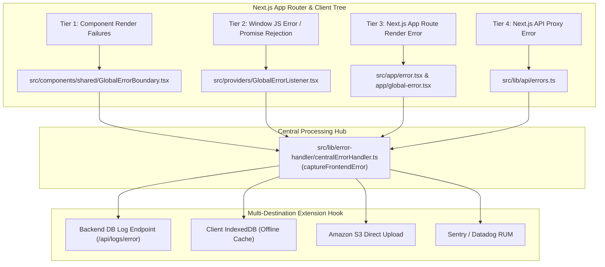

# ⚛️ Next.js & React Frontend Centralized Error Handling Guide

This document provides a comprehensive operational guide, detailed architecture, code examples for multi-destination persistence, real-world use cases, and future roadmap recommendations for the **Frontend Centralized Error Handling System** in `draft_v2-frontend`.

---

## 1. System Architecture & High-Level Flow

The frontend error handling system utilizes a **4-Tier Interception Network** to capture React component rendering crashes, unhandled JavaScript window errors, uncaught async promise rejections, Next.js page failures, and API proxy route errors.



---

## 2. Component Directory & File Locations

| Component | File Location | Responsibility |
| :--- | :--- | :--- |
| **Central Dispatcher** | [`src/lib/error-handler/centralErrorHandler.ts`](file:///d:/ArchitecturePlayBook/v1.1/draft_v2-frontend/src/lib/error-handler/centralErrorHandler.ts) | Formats payload, gathers browser metadata, logs to console, and executes post-capture hooks. |
| **React Error Boundary** | [`src/components/shared/GlobalErrorBoundary.tsx`](file:///d:/ArchitecturePlayBook/v1.1/draft_v2-frontend/src/components/shared/GlobalErrorBoundary.tsx) | Class component capturing lifecycle errors in the React component tree; renders recovery UI. |
| **Window Event Listener** | [`src/providers/GlobalErrorListener.tsx`](file:///d:/ArchitecturePlayBook/v1.1/draft_v2-frontend/src/providers/GlobalErrorListener.tsx) | Listens to `window.onerror` and `window.onunhandledrejection` across the browser window. |
| **App Route Error Page** | [`src/app/error.tsx`](file:///d:/ArchitecturePlayBook/v1.1/draft_v2-frontend/src/app/error.tsx) | Next.js App Router page error boundary for route-level crashes. |
| **Global Root Error Page** | [`src/app/global-error.tsx`](file:///d:/ArchitecturePlayBook/v1.1/draft_v2-frontend/src/app/global-error.tsx) | Intercepts crashes in the root `layout.tsx`. |
| **API Proxy Handler** | [`src/lib/api/errors.ts`](file:///d:/ArchitecturePlayBook/v1.1/draft_v2-frontend/src/lib/api/errors.ts) | Routes Next.js BFF API proxy errors through `captureFrontendError`. |
| **Layout Wrapper** | [`src/app/layout.tsx`](file:///d:/ArchitecturePlayBook/v1.1/draft_v2-frontend/src/app/layout.tsx) | Wraps the application with `GlobalErrorListener` and `GlobalErrorBoundary`. |

---

## 3. Standardized Error Payload Schema

Every error passed to `captureFrontendError` is normalized into a JSON-serializable object with the following schema:

```json
{
  "timestamp": "2026-07-29T09:15:00.123Z",
  "source": "react_error_boundary",
  "name": "TypeError",
  "message": "Cannot read properties of undefined (reading 'map')",
  "stack": "TypeError: Cannot read properties of undefined (reading 'map')\n    at ProjectList (webpack-internal:///./src/components/ProjectList.tsx:24:12)",
  "url": "http://localhost:5173/dashboard/projects",
  "userAgent": "Mozilla/5.0 (Windows NT 10.0; Win64; x64) AppleWebKit/537.36",
  "componentStack": "\n    in ProjectList\n    in div\n    in DashboardPage",
  "extra": {
    "source": "react_error_boundary"
  }
}
```

---

## 4. Multi-Destination Persistence Examples

Inside [`src/lib/error-handler/centralErrorHandler.ts`](file:///d:/ArchitecturePlayBook/v1.1/draft_v2-frontend/src/lib/error-handler/centralErrorHandler.ts), find the `// POST-CAPTURE EXTENSION HOOK` block. Below are complete, copy-paste ready implementations for common storage destinations.

### Example A: Forwarding Error Payload to Backend Logging API

```typescript
// Inside captureFrontendError():
if (isBrowser) {
  fetch('/api/logs/error', {
    method: 'POST',
    headers: { 'Content-Type': 'application/json' },
    body: JSON.stringify(payload),
    keepalive: true, // Ensures request completes even if page unloads
  }).catch((err) => {
    console.warn('Failed to report frontend error to backend:', err);
  });
}
```

---

### Example B: Storing Errors in Client IndexedDB (Offline Resilience)

Using Dexie / IndexedDB for offline app support:

```typescript
import { db } from '@/shared/offline/db';

async function persistErrorOffline(payload: ErrorPayload) {
  try {
    await db.table('error_logs').add({
      ...payload,
      synced: false,
    });
  } catch (idbErr) {
    console.error('Failed to store error in IndexedDB:', idbErr);
  }
}
```

---

### Example C: Uploading Directly to Amazon S3 via Presigned URL

```typescript
async function uploadErrorToS3(payload: ErrorPayload) {
  try {
    // 1. Get presigned upload URL from backend
    const res = await fetch('/api/logs/s3-presigned-url', { method: 'POST' });
    const { uploadUrl } = await res.json();
    
    // 2. Put JSON object directly to S3
    await fetch(uploadUrl, {
      method: 'PUT',
      headers: { 'Content-Type': 'application/json' },
      body: JSON.stringify(payload),
    });
  } catch (err) {
    console.error('S3 Direct Upload Failed:', err);
  }
}
```

---

### Example D: Sentry / LogRocket Integration Hook

```typescript
import * as Sentry from '@sentry/nextjs';

function sendToSentry(payload: ErrorPayload) {
  Sentry.withScope((scope) => {
    scope.setTag('error_source', payload.source);
    if (payload.componentStack) {
      scope.setExtra('componentStack', payload.componentStack);
    }
    Sentry.captureException(new Error(payload.message));
  });
}
```

---

## 5. Real-World Use Cases & Execution Scenarios

### Scenario 1: React Component Lifecycle Render Crash
- **Trigger**: A component attempts to access `user.profile.name` when `profile` is `undefined`.
- **Handling**:
  1. Caught by `GlobalErrorBoundary.componentDidCatch`.
  2. Calls `captureFrontendError(error, { source: 'react_error_boundary', componentStack })`.
  3. Displays a clean, branded "Something went wrong" recovery UI with a "Try Again" button.
  4. Non-crashing parts of the UI (e.g. Navbar) remain functional.

### Scenario 2: Uncaught Async Promise Rejection
- **Trigger**: A custom button handler executes `await fetch('/api/some-broken-endpoint')` without a `try...catch` block.
- **Handling**:
  1. Triggered window `unhandledrejection` event.
  2. Captured by `GlobalErrorListener`.
  3. Calls `captureFrontendError(event.reason, { source: 'unhandled_rejection' })`.

### Scenario 3: Next.js App Router Page Error
- **Trigger**: Server component or Client page rendering fails during route navigation.
- **Handling**:
  1. Intercepted by `src/app/error.tsx`.
  2. Calls `captureFrontendError(error, { source: 'next_error_page' })`.
  3. Displays the route-level fallback UI with a button to reset the route state.

### Scenario 4: Manual Exception Capture in Custom Components
- **Trigger**: In complex UI components (e.g. 3D canvas, SweetHome3D, heavy file parsers), wrap code blocks in `try...catch` and manually send to central handler:
  ```typescript
  import { captureFrontendError } from '@/lib/error-handler/centralErrorHandler';
  
  try {
    parse3DModelFile(buffer);
  } catch (err) {
    captureFrontendError(err, { source: '3d_model_parser', fileName: file.name });
    showToast('Failed to load 3D file format');
  }
  ```

---

## 6. Future Enhancements & Roadmap Recommendations

1. **Sourcemap Stack Trace Mapping**:
   - Integrate `@minified-size/sourcemap-codec` or backend sourcemap parser so production minified stack traces (`at a (main-1234.js:1:500)`) map back to original TypeScript file names and line numbers.
2. **User Session Replay Linking**:
   - Attach user session ID (from `AuthProvider` or session storage) to `payload.extra` to correlate client errors with user activity logs.
3. **Automatic Offline Syncing**:
   - When offline errors stored in IndexedDB detect `navigator.onLine === true`, automatically flush the queued errors to the server.
4. **PII Filtering**:
   - Sanitize form inputs or state objects before attaching to `payload.extra` (strip sensitive passwords, tokens, or personal identifiers).
