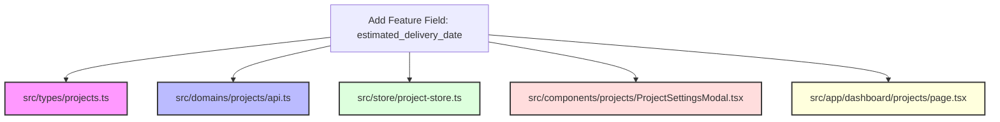

# Next.js Frontend Architectural & Modularization Report

**Target:** Enterprise Production Readiness  
**Lead Reviewer:** Principal Frontend Architect & Lead Engineer  
**Project:** Architecture Playbook Frontend (`draft_v2-frontend`)  
**Date:** July 13, 2026

---

## 🎯 Executive Summary

This report presents a unified evaluation of the architectural patterns, structural design decisions, component modularity, API communication layers, security profiles, and TypeScript usage in the frontend codebase.

The system features a custom Next.js **Backend-for-Frontend (BFF) proxy** that isolates authentication details (like JWT rotation) on the server, using `HttpOnly`, `SameSite="lax"`, and `Secure` cookies to defend against Cross-Site Scripting (XSS).

However, several critical gaps must be resolved to meet enterprise standards:

1. **Route Directory Pollution:** Placing UI views, sub-tab panels, and 3D loaders inside the `src/app/dashboard/` route directory increases bundle size, complicates code splitting, and creates dependency cycles.
2. **Dynamic 401 Latency Overhead (3-Roundtrip Defect):** Bypassing immediate validation in the BFF proxy forces expired access token requests to make three network roundtrips to Django, slowing down rendering performance.
3. **Dead Server-Side Code:** `getCurrentUser` and `djangoFetch` are defined but unused in the repository. They lack token refresh wrappers, meaning that using them in Server Pages will lead to random 401 crashes on token expiration.
4. **Landing Page SEO Barriers:** The root route `src/app/page.tsx` is forced into a client-only component (`"use client"`), blocking search engine crawlability and increasing script evaluation latency.
5. **Type Safety Bypasses:** Widespread use of `<any>` casting inside the core API domain layer.
6. **State Modularity Gaps:** Underutilization of the pre-configured TanStack Query cache provider, resulting in duplicate client-side requests and layout state thrashing.

---

## 🔍 Part 1: Deep-Dive Analysis on Route Directory Pollution

### The Defect: App Router Directory Pollution

The project currently keeps its layouts, sub-tabs, drawers, and heavy engines directly inside the routing folder `src/app/dashboard/`. For example, `src/app/dashboard/projects/[id]/estimation/page.tsx` and sibling files house complex drawing canvas components, estimation grid calculators, and toolbar states.

This layout is a major scaling defect for several reasons:

#### 1. Code-Splitting and Bundle Leaks

Next.js App Router performs static analysis on the `src/app/` folder to build route-segments and split client-side JS bundles.

- **The Mechanism:** When components, store connections, and 3D rendering engines (`ModelViewer` importing Three.js) live directly inside routing subfolders, Webpack/Turbopack is forced to compile them into layout-specific chunks.
- **The Performance Penalty:** Since these components are adjacent to layouts, the bundler cannot isolate their dependencies. A user navigating to a simple calendar dashboard path page may end up downloading heavy canvas drawing libraries or Three.js bundles simply because they were imported by files inside adjacent routing directories.

#### 2. Cross-Route Reuse Violations (High Coupling)

- **The Problem:** UI elements like `ProjectCard.tsx` or `NCRManager.tsx` are housed within the `/dashboard/` folder tree.
- **The Reuse Conflict:** If you want to reuse the `ProjectCard` on a public showroom layout `/showroom` or inside a public task detail page `/share/task/[uid]`, you are forced to import a component located inside the private `/dashboard/` directory. This creates circular imports and violates folder encapsulation.

```
[Public Route: /share/task/[uid]]
       │
       ▼ (Smell: Importing from private folder)
[src/app/dashboard/projects/ProjectCard.tsx]
```

#### 3. Directory Noise & Review Friction (DX)

- **The Problem:** When a single folder contains page routing files (`page.tsx`, `layout.tsx`), 30+ UI tab components, modals, and helper utilities, it creates massive directories.
- **The Impact:** Finding files is tedious. Furthermore, when multiple developers are adding features, they are all editing files in the same directory path, resulting in constant git merge conflicts on page files, layout files, and shared styles.

---

## 🔍 Part 2: Dynamic 401 Latency Overhead (3-Roundtrip Defect)

- **Current Implementation:** The BFF proxy interceptor `refreshIfNeeded` in [refresh.ts](file:///d:/ArchitecturePlayBook/v1.1/draft_v2-frontend/src/lib/api/refresh.ts) acts lazily. It only executes a token refresh when Django responds with an HTTP `401 Unauthorized` status.
- **The Latency Trap:** When the access token expires (which happens every 15 minutes), any request made by the browser must execute **three network roundtrips**:
  1. **Roundtrip 1 (Client ➔ Next.js Proxy ➔ Django):** Next.js forwards the request containing the expired access token. Django evaluates the header and returns `401 Unauthorized`.
  2. **Roundtrip 2 (Next.js Proxy ➔ Django /refresh):** Next.js catches the 401, extracts the refresh token from the cookie, and calls Django's `/token/refresh/` route. Django validates and returns a new access token.
  3. **Roundtrip 3 (Next.js Proxy ➔ Django retry ➔ Client):** Next.js proxy retries the original request with the new access token. Django returns the successful data payload, which is then sent back to the browser along with the `Set-Cookie` header.

```
Browser               Next.js Proxy             Django
   │                        │                      │
   │─── 1. Access Req ─────>│                      │
   │                        │─── 2. Expired JWT ──>│
   │                        │<── 3. 401 response ──│ (Roundtrip 1)
   │                        │                      │
   │                        │─── 4. JWT refresh ──>│
   │                        │<── 5. New JWT ───────│ (Roundtrip 2)
   │                        │                      │
   │                        │─── 6. Retry request >│
   │                        │<── 7. Data return ───│ (Roundtrip 3)
   │<── 8. Success + Cookie─│                      │
```

- **Why it matters:** This lazy refresh pattern introduces significant latency overhead for users who happen to trigger an API call on JWT expiry. The page loading state will hang for three network roundtrips.
- **Recommended Solution:** Check token expiration server-side in the BFF proxy _before_ making the request to Django. If the access token is expired, trigger the refresh operation _immediately_ and then forward the request to Django, reducing the network latency from 3 roundtrips to 2:
  ```typescript
  // In handler.ts or request.ts
  const accessToken = req.cookies.get(COOKIE_ACCESS_TOKEN)?.value;
  if (accessToken && isTokenExpired(accessToken)) {
    // Refresh access token immediately before forwarding
    const newTokens = await refreshAccessTokenDirectly(req);
    ...
  }
  ```

---

## 🔍 Part 3: Dead Server-Side Code & Lack of Server Refresh

- **Current Implementation:** [auth.ts](file:///d:/ArchitecturePlayBook/v1.1/draft_v2-frontend/src/lib/auth.ts) defines `getCurrentUser()` and `djangoFetch()` server-side helpers, which use raw `fetch` to connect to Django.
- **The Defect:** These functions are **dead code** (never imported elsewhere). More importantly, if they are used to migrate toward Server Pages, they will crash the rendering pipeline on token expiration. They contain **no refresh interceptor or error fallback logic**.
- **Why it matters:** If a Server Page renders a component that uses `djangoFetch()`, and the user's access token is expired, the server component will receive a 401 error and render an error page or blank layout, even if the user has a valid refresh token.
- **Recommended Solution:** Hardcode server-side token checks inside `djangoFetch` using `isTokenExpired(accessToken)`. If the access token is expired, perform a server-to-server POST to Django's token refresh route using the refresh token cookie, update the server context, and rewrite cookies inside response headers.

---

## 🔍 Part 4: Landing Page SEO Barriers

- **Current Implementation:** The root page [app/page.tsx](file:///d:/ArchitecturePlayBook/v1.1/draft_v2-frontend/src/app/page.tsx) is marked with `"use client"` at line 1.
- **The Defect:** The root landing page features heavy client-side step animations using `framer-motion` and local state message logs.
- **Why it matters:** Since the root page is rendered on the client, search engine index crawlers (like Googlebot) cannot easily parse metadata, keywords, and structural headers. This impacts Search Engine Optimization (SEO) rankings.
- **Recommended Solution:** Split the root page:
  - Keep `src/app/page.tsx` as a **Server Component** containing semantic HTML structure, headings, metadata, and body tags.
  - Extract heavy animations (like `MessageItem` and `StepSection`) into a separate client-side component (e.g., `components/landing/LandingVisuals.tsx`) and load them dynamically.

---

## 🔍 Part 5: Modularization & Codebase Structure

### 1. Architectural Slicing Analysis: Layered vs. Vertical

The codebase is currently organized by technical layers:

```
src/
├── app/          # Next.js Routing Layer (Technical)
├── components/   # Presentation Layer (Technical)
├── domains/      # Business API Client Layer (Technical)
├── store/        # State Management Layer (Technical)
├── types/        # TypeScript Definitions Layer (Technical)
└── hooks/        # Shared Functionality Layer (Technical)
```

This technical separation results in **low cohesion** and **high vertical coupling**.

Whenever a developer implements or extends a feature (e.g., adding a new custom data field like `estimated_delivery_date` to `Project`), they are forced to modify at least 5 different top-level folders located far apart in the directory tree:



- **Why this is an issue:**
  1. **Cognitive Overload:** Developers must toggle between multiple unrelated folder structures just to edit one conceptual feature block.
  2. **High Git Friction:** Multiple developers working on different aspects of `projects` will constantly get git conflicts in `src/types/projects.ts`, `src/domains/projects/api.ts`, and Zustand state definitions because these file files act as monolithic global registers.
  3. **Fragile Codebase Boundary:** It is easy to accidentally import component-level hooks or styles into stores or domain API files, introducing silent circular dependencies that crash server builds.

### 2. Feature-Specific Fragmentation Audits

#### The "Projects & Estimation" Module

- **State files:** `src/store/project-store.ts` (Zustand state) and `src/store/project-nav-store.ts` (Zustand layout state).
- **API Definitions:** `src/domains/projects/api.ts` (Django fetch proxy mapping).
- **UI Tab Layouts:** `src/components/projects/DataHubTab.tsx`, `KanbanTab.tsx`, `GanttTab.tsx`.
- **Dynamic Routes:** `src/app/dashboard/projects/[id]/page.tsx` and subdirectories.
- **Estimation Workspace:** `src/app/dashboard/projects/[id]/estimation/page.tsx`.
- **Workspace Store:** `src/store/estimation-store.ts`.
- **Takeoff Canvas Drawing:** `src/components/estimation/TakeoffCanvas.tsx`.
- **Takeoff Typings:** `src/types/estimation.types.ts`.

> [!NOTE]
> The projects and estimation features are split across **nine different directories**. The estimation module depends heavily on Zustand models from `project-store.ts`, yet its state functions are defined inside `estimation-store.ts`. This separation leads to tight coupling, where any change to the shape of `ProjectDetail` will break the canvas math on the estimation sub-page.

#### The "Field Diary" Module

- **Models:** No types exist in the `src/types` folder.
- **API Definitions:** Defined as methods inside `projectsApi` (`src/domains/projects/api.ts#L288-L297`).
- **Detailed Form Component:** [DiaryEntryDetail.tsx](file:///d:/ArchitecturePlayBook/v1.1/draft_v2-frontend/src/components/projects/DiaryEntryDetail.tsx).
- **Sidebar Tab Component:** `TaskFieldDiaryTab.tsx`.
- **BFF Bypasses:** Direct URL calls using raw `fetchFromBff` string paths inside `DiaryEntryDetail.tsx` (violating domain segregation).

> [!WARNING]
> Because the Daily Field Diary was horizontally partitioned under the "Projects" component tree, it lacks a dedicated service layer structure. Developers have placed database requests directly inside UI layers, resulting in hardcoded API paths inside presentation templates.

#### The "Billing & Subscription" Module

- **Component Layer:** `src/components/billing/TrialBanner.tsx`.
- **API Layer:** `src/domains/billing/api.ts`.
- **Route Layouts:** `src/app/dashboard/subscription/page.tsx`.

---

## 🛠️ Part 6: Proposed Solution Measures & Guidelines

We propose adopting the **Server-Side Page / Client-Side Container View Pattern** (also called the Hybrid boundary pattern) for all routing paths.

This pattern enforces a strict separation of routing concerns (in `src/app/`) from visual layout/state concerns (in `src/views/` and `src/components/`).

### 1. The Route-Component Segregation Standard

- **`src/app/` (Server Gates):** The `src/app/` folder should **only** contain Next.js routing configs (`page.tsx`, `layout.tsx`, `template.tsx`). Files here must remain Server Components by default. They handle URL routing params, extract search queries, read server cookies, verify authorization, and render metadata tags for SEO. They do not import CSS files, Three.js modules, or state store actions.
- **`src/views/` (Client Containers):** All visual views and page component containers must be extracted into `src/views/` (e.g. `src/views/projects/ProjectDetailView.tsx`), marked with `"use client"`, and handle interactive logic, TanStack Query hooks, and local state.

> [!IMPORTANT]
> **Next.js Pages Router Conflict Avoidance:**
> We explicitly name the container folder `src/views/` instead of `src/pages/`. Next.js reserves `src/pages/` for the legacy Pages Router. Using `src/pages/` alongside `src/app/` can trigger route name collisions, build warning messages, or unexpected webpack routing behaviors during compile-time.

```
       [Client Browser]
              │
              ▼ (Page request)
   ┌────────────────────────────────────────────────────────┐
   │ Next.js App Server (Server Page / Route Gate)          │
   │  * src/app/dashboard/projects/[id]/page.tsx            │
   │  * Fast server-side cookie authorization check         │
   │  * Pre-renders metadata for SEO                       │
   └────────────────────────────────────────────────────────┘
              │
              ▼ (Mounts & Hydrates client container view)
   ┌────────────────────────────────────────────────────────┐
   │ Client Container View (Client Boundary)                │
   │  * src/views/projects/ProjectDetailView.tsx ("use client")│
   │  * Pulls from TanStack Query hook useQuery             │
   │  * Handles layout tabs and sub-components              │
   └────────────────────────────────────────────────────────┘
```

### 2. Code Implementation Blueprint

#### The Server Page Route

**File:** [src/app/dashboard/projects/[id]/page.tsx](file:///d:/ArchitecturePlayBook/v1.1/draft_v2-frontend/src/app/dashboard/projects/[id]/page.tsx)

```typescript
import { cookies } from "next/headers";
import { redirect } from "next/navigation";
import { ProjectDetailView } from "@/views/projects/ProjectDetailView";
import { COOKIE_REFRESH_TOKEN } from "@/lib/api/constants";

interface PageProps {
  params: Promise<{ id: string }>;
}

// Keep the Page Route as a strict Server Component
export default async function ProjectDetailPage({ params }: PageProps) {
  const { id } = await params;
  const cookieStore = await cookies();
  const sessionToken = cookieStore.get(COOKIE_REFRESH_TOKEN)?.value;

  // Server-side Route Guard (zero layout flash)
  if (!sessionToken) {
    redirect("/login");
  }

  // Mounts and delivers param values directly to the Client Container View
  return <ProjectDetailView projectUid={id} />;
}
```

#### The Client View Container

**File:** `src/views/projects/ProjectDetailView.tsx`

```typescript
"use client";

import React from "react";
import { useQuery } from "@tanstack/react-query";
import { projectsApi } from "@/domains/projects/api";
import { Spinner } from "@/components/ui/Spinner";
import { KanbanTab } from "@/components/projects/KanbanTab";
import { useProjectStore } from "@/store/project-store";

interface ProjectDetailViewProps {
  projectUid: string;
}

// Mark as a Client boundary for interactivity
export const ProjectDetailView: React.FC<ProjectDetailViewProps> = ({ projectUid }) => {
  const { activeTab } = useProjectStore(); // UI layout states only

  // Declarative TanStack Query for cache sync
  const { data: project, isLoading, error } = useQuery({
    queryKey: ["project", projectUid],
    queryFn: () => projectsApi.getProjectDetails(projectUid),
    refetchOnWindowFocus: true
  });

  if (isLoading) {
    return <div className="h-screen flex items-center justify-center"><Spinner size="lg" /></div>;
  }

  if (error || !project) {
    return <div className="p-8 text-center text-red-500">Failed to load project workspace.</div>;
  }

  // Render layouts and modular child components
  return (
    <div className="space-y-6">
      <h1 className="text-3xl font-bold">{project.title}</h1>
      {activeTab === "kanban" && <KanbanTab project={project} />}
      {/* other tabs */}
    </div>
  );
};
```

---

## 📂 Part 7: Proposing the New Enterprise Folder Structure

To resolve horizontal fragmentation and logically group feature structures, we propose this directory layout:

```
src/
├── app/                  # Next.js Server Routing Gateway (NO heavy logic)
│   ├── layout.tsx        # Root shell (loads metadata)
│   ├── middleware.ts     # Server-side cookie check (Route protector)
│   ├── api/              # BFF catcher routes
│   └── dashboard/
│       ├── page.tsx      # Dashboard Server Page (mounts DashboardView)
│       └── projects/
│           ├── page.tsx  # Projects List Server Page (mounts ProjectsRegistryView)
│           └── [id]/
│               └── page.tsx # Project Detail Server Page (mounts ProjectDetailView)
│
├── views/                # Client-Side Page Containers (use client boundary)
│   ├── dashboard/
│   │   └── DashboardView.tsx # Aggregated metrics and user layouts
│   └── projects/
│       ├── ProjectsRegistryView.tsx # Project list, search triggers, filtering
│       ├── ProjectDetailView.tsx    # Tab switcher (Kanban, Gantt, Matrix)
│       └── EstimationView.tsx       # 2D estimation canvas & takeoffs
│
├── components/           # UI Shared & Feature Primitive Components
│   ├── ui/               # Base shadcn / layout primitives (buttons, dialogs)
│   ├── shared/           # Common components (Navbar, ThemeToggle)
│   └── projects/         # Project UI parts (Card, StatusDropdown)
│       └── task-panel/   # Decomposed task panel subcomponents
│
├── domains/              # Clean API Client Services (Network contracts only)
│   ├── auth/             # authApi (typed exports)
│   └── projects/         # projectsApi (typed exports)
│
├── hooks/                # Global custom hooks (usePermissions, useOnline)
├── providers/            # React context providers (QueryProvider, ThemeProvider)
├── store/                # Zustand global UI states (sidebarCollapsed, activeTab)
├── types/                # Strict TypeScript domain interfaces (Project, Task, User)
└── utils/                # Utility math functions (canvas geometry, dates)
```

---

## 📈 Quality Scoring Sheet

| Metric                   |    Score    | Key Area                                                                   |
| :----------------------- | :---------: | :------------------------------------------------------------------------- |
| **Overall Architecture** | **8 / 10**  | Domain structure is modular, but domain layer abstractions are bypassed.   |
| **Next.js Features**     | **6 / 10**  | App Router segments are correct, but layouts do not use Server Components. |
| **React Best Practices** | **7 / 10**  | Custom hooks used, but state invalidations are imperative.                 |
| **Authentication**       | **9 / 10**  | Secure HttpOnly cookies are used.                                          |
| **Authorization**        | **8 / 10**  | Triple-layered RBAC logic is clean, but UI checks are inline.              |
| **API Client & Proxy**   | **10 / 10** | Excellent request buffering and token forwarding structures.               |
| **State Management**     | **8 / 10**  | Zustand handles UI state, but server caches are duplicated.                |
| **TypeScript**           | **6 / 10**  | Strict compiler enabled, but bypassed with `<any>` types.                  |
| **Security**             | **9 / 10**  | Strong CSP, safe proxy errors, and secure cookies.                         |
| **Performance**          | **6 / 10**  | Heavy Three.js bundle and N+1 Matrix queries need optimization.            |
| **Code Quality**         | **7 / 10**  | Well-commented, but contains monolithic files.                             |
| **Production Ready**     | **7 / 10**  | Needs security middleware and concurrent refresh locks.                    |

---

## 🛠️ Defect Log & Prioritized Roadmap

### 1. Defect Log

#### Defect 1: Lack of Next.js Route Protection Middleware (Severity: High)

- **Affected File(s):** No `middleware.ts` file exists at the root.
- **Current Implementation:** Route protection is handled React-reactively post-load.
- **Problem:** Unauthenticated users can navigate directly to protected paths (e.g., `/dashboard/*`), exposing layout structures.
- **Recommended Solution:** Add a server-side Next.js route protection middleware to block unauthenticated requests.

#### Defect 2: Concurrency Race Condition in Token Refresh Handler (Severity: High)

- **Affected File(s):** [refresh.ts](file:///d:/ArchitecturePlayBook/v1.1/draft_v2-frontend/src/lib/api/refresh.ts)
- **Current Implementation:** Parallel requests trigger concurrent refresh calls.
- **Problem:** Simultaneous token refresh requests invalidate rotated refresh tokens.
- **Recommended Solution:** Implement a centralized refresh locking mechanism (mutex) to deduplicate concurrent requests.

#### Defect 3: Dexie Offline Crash on FormData Serialization (Severity: High)

- **Affected File(s):** [fetchFromBff.ts](file:///d:/ArchitecturePlayBook/v1.1/draft_v2-frontend/src/shared/api/fetchFromBff.ts#L42-L50), [db.ts](file:///d:/ArchitecturePlayBook/v1.1/draft_v2-frontend/src/shared/offline/db.ts)
- **Current Implementation:** Offline FormData mutations are added directly to the IndexedDB sync queue.
- **Problem:** `FormData` objects cannot be cloned by IndexedDB, causing browser crashes.
- **Recommended Solution:** Convert FormData files to Blobs or flag binary uploads as online-only.

#### Defect 4: Pervasive `<any>` in Service Layer (projects/api.ts) (Severity: Medium)

- **Affected File(s):** [projects/api.ts](file:///d:/ArchitecturePlayBook/v1.1/draft_v2-frontend/src/domains/projects/api.ts)
- **Current Implementation:** Over 50 service functions cast the fetch payload as `any`.
- **Problem:** Bypasses compile-time type verification.
- **Recommended Solution:** Replace `<any>` returns with concrete type interfaces.

#### Defect 5: Direct fetch Call in Command Palette (Severity: Medium)

- **Affected File(s):** [CommandPalette.tsx](file:///d:/ArchitecturePlayBook/v1.1/draft_v2-frontend/src/components/ui/CommandPalette.tsx)
- **Current Implementation:** Line 67 calls browser `fetch` directly.
- **Problem:** Bypasses BFF unified cookie/auth and offline caching logic.
- **Recommended Solution:** Replace direct `fetch` with `fetchFromBff`.

#### Defect 6: Dynamic 3D Engine Bundle Loading Issues (Severity: Medium)

- **Affected File(s):** [TaskExecutionSidePanel.tsx](file:///d:/ArchitecturePlayBook/v1.1/draft_v2-frontend/src/components/projects/TaskExecutionSidePanel.tsx)
- **Current Implementation:** `ModelViewer` is statically imported.
- **Problem:** Statically importing `ModelViewer` includes Three.js in the core dashboard bundle.
- **Recommended Solution:** Import `ModelViewer` dynamically using `next/dynamic` with `ssr: false`.

### 2. Execution Classification

- **Quick Wins (Less than 1 day):**
  - Implement route protection `src/middleware.ts`.
  - Convert `ModelViewer` to use dynamic imports.
  - Add default `loading.tsx` and `error.tsx` layouts.
  - Safe-guard the Offline DB FormData uploads.
- **Medium Effort (1-3 days):**
  - Integrate concurrent refresh promise lock.
  - Decouple Matrix query triggers from project store hydration.
  - Build the `<PermissionGuard>` layout wrapper.
- **Major Refactoring (3+ days):**
  - Break down the `TaskExecutionSidePanel` into modular tabs.
  - Migrate raw `useEffect` list fetching across dashboard modules to TanStack Query.
